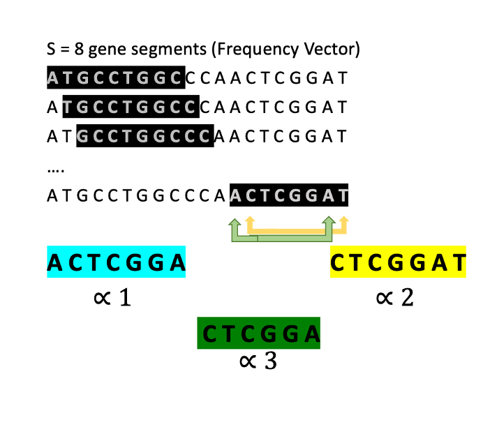
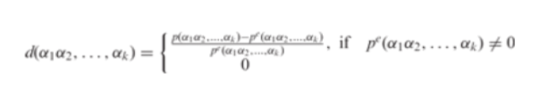
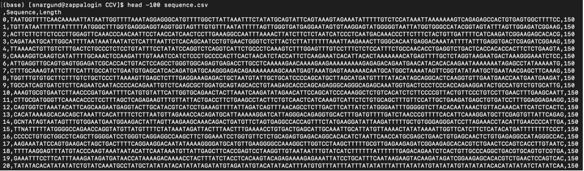
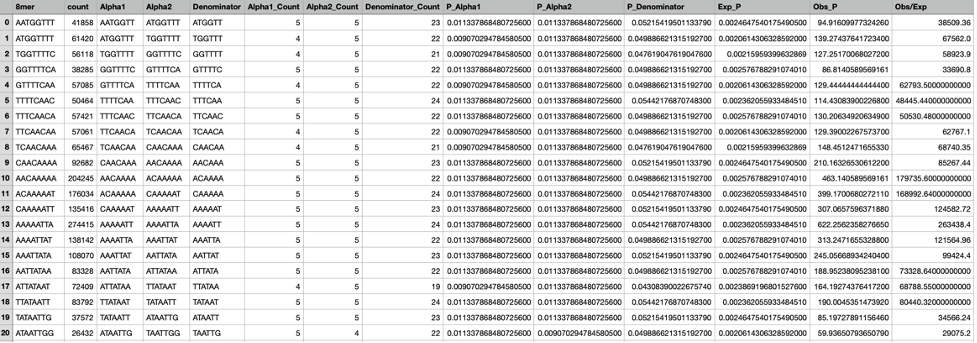

# About the Project

Complete Composition Vector Algorithm to find Breakpoints in Cancer Genome

-	Investigated genetic instability in cancer genome using high-dimensional Complete Composition Vector (CCV) based on the genotype thresholds
-	Current techniques in genotyping are not efficient for identifying genetic reassortment events
-	Traditionally CCV is used to study evolutionary footprint of pathogens to understand their origin of spread
-	Breakpoints in the genome are locations on a chromosome where DNA might get deleted, inverted, or swapped around. Tumor genomes exhibit hundreds of DNA breakpoints. Some of them promote tumor development by disrupting crucial functional elements, and thus survive the selective pressure that acts on cancer cells
-	Sample- Short sequencing reads of tumor-normal pair in FASTQ file format
-	Programming language: Python

Sliding window technique:

Expected Probability through a Markov Model is:
P(∝)= f(∝)/ Total length -kmerLength+1
P(S)= P(∝1 )(∝2) /P(∝3)
Observed Probability is actual probability observed.
Score= Observed Probability/Expected Probability
K-mers with different score for tumor normal pair may be breakpoints

---

Program extracts only sequence from FASTQ file by opening the files in chuck and appends to a DataFrame. Outputs in CSV file with sequence in first columns and calculates length of sequence in second column- dfchunks.py

sequence.py opens the above created CSV file and applies sliding window technique to sequence. Extracts 8mers and calculates Expected and Observed probability for each 8mer.

-	Compare the Observed Probability/Expected Probability values of each 8mer in tumor-normal pair sequences
-	Filter out potential breakpoints
-	View the breakpoints on Genome Browser
